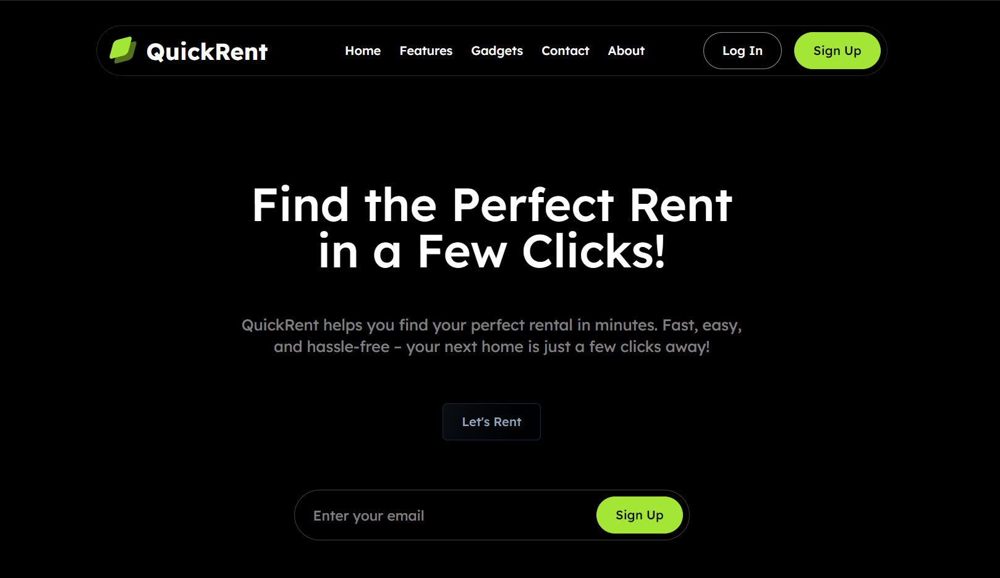
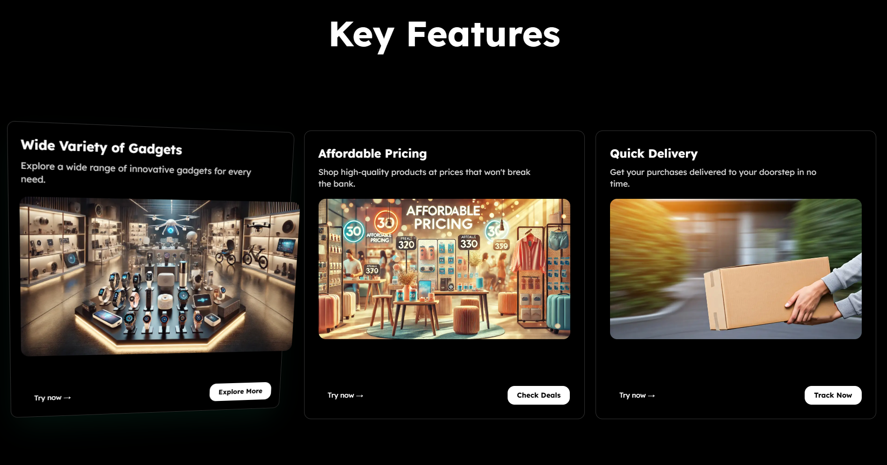
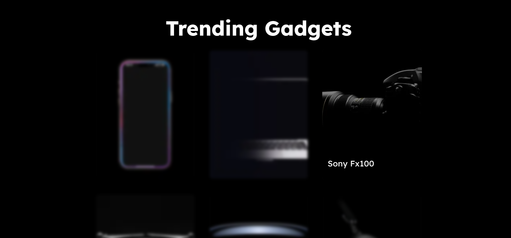
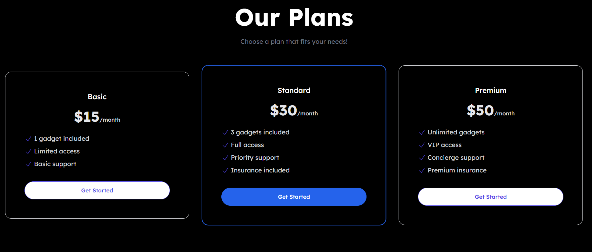
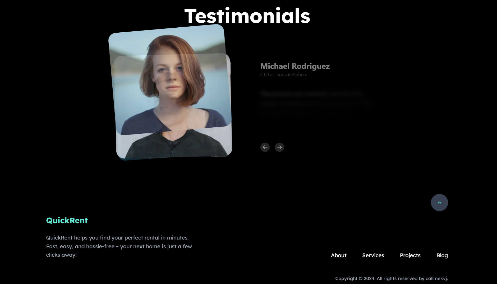
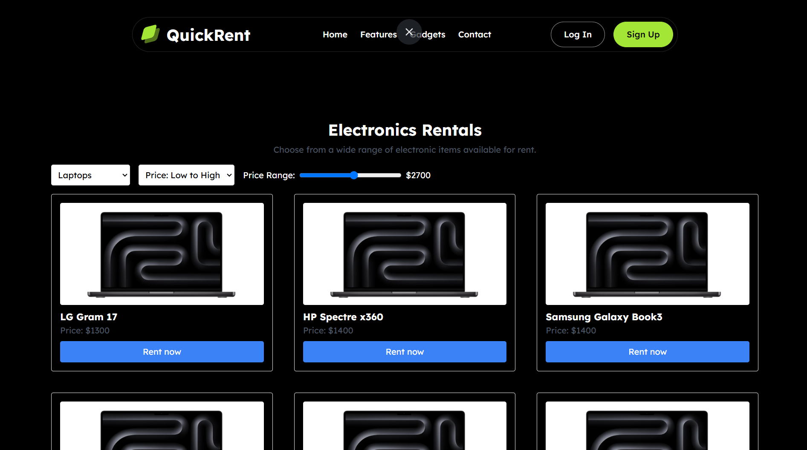
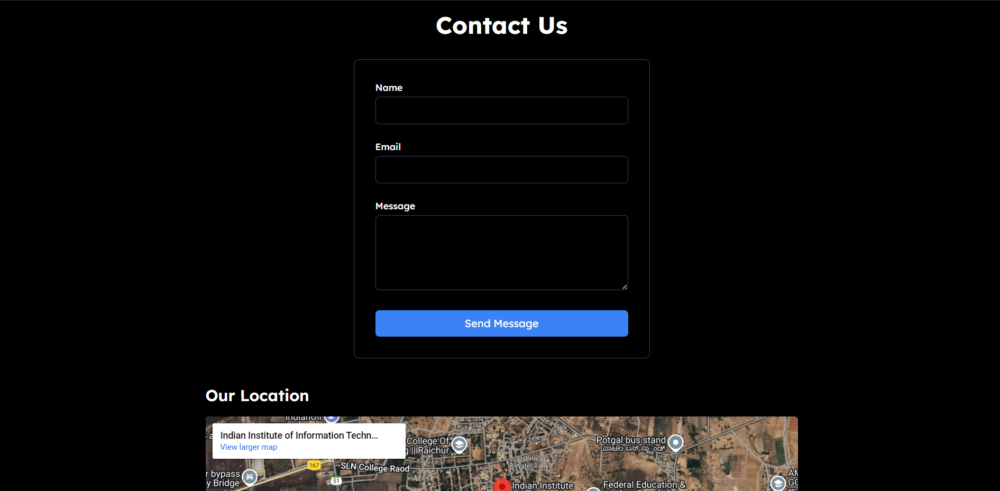

# QuickRent 🚀

QuickRent is a modern web application designed as part of an internship task evaluation by NIT K. The app allows users to explore various rental options and gadgets, with a sleek user interface built using Next.js, Tailwind CSS, and various libraries like Aeternity UI, Hyper UI, and Framer Motion.

This project features front-end development with some backend functionality like authentication via Clerk and form collection using Firebase.

## Approach 🛠️

The application uses the latest front-end technologies to create an interactive and responsive user interface. The backend integrates Clerk for user authentication, ensuring secure access. Firebase is utilized for form handling, providing a seamless user experience.

Key Technologies:
- **Next.js** for server-side rendering and routing.
- **Tailwind CSS** for responsive and customizable styling.
- **Aeternity UI** and **Hyper UI** for ready-to-use components.
- **Framer Motion** and **Motion** for smooth animations.
- **Clerk** for authentication (login/signup).
- **Firebase** for form data collection.

## Features 🌟

- **Authentication:** Secure login/signup through Clerk to access protected pages like the Gadgets page.
- **Smooth Animations:** Using Framer Motion for beautiful UI transitions.
- **Responsive Design:** Fully responsive design using Tailwind CSS for a seamless mobile and desktop experience.
- **Firebase Integration:** Firebase for handling form submissions.

## Accessing the Project 🔐

1. The project is live and publicly accessible at [quickrent-mu.vercel.app](https://quickrent-mu.vercel.app/).
2. Some pages require authentication to access. If you prefer not to authenticate, you can still view the screenshots.
3. To access the Gadgets page, you must log in or sign up using the Clerk authentication system. Without authentication, access to the Gadgets page will be restricted.


## Setup and Run Instructions ⚙️

### Prerequisites

1. **Node.js** (v16 or higher) installed on your machine.
2. **Git** installed to clone the repository.

### Steps to Run Locally

1. Clone the repository:

   ```bash
   git clone https://github.com/<your-username>/QuickRent.git
   cd QuickRent
   ```

2. Install dependencies:

   ```bash
   npm install
   ```

3. Set up your **Clerk** and **Firebase** credentials by following the setup instructions in their respective documentation.
   - Clerk: [https://clerk.dev/docs](https://clerk.dev/docs)
   - Firebase: [https://firebase.google.com/docs](https://firebase.google.com/docs)

4. Create a `.env.local` file in the root directory and add your environment variables:

   ```bash
   NEXT_PUBLIC_CLERK_FRONTEND_API=<your-clerk-frontend-api>
   NEXT_PUBLIC_CLERK_API_KEY=<your-clerk-api-key>
   NEXT_PUBLIC_FIREBASE_API_KEY=<your-firebase-api-key>
   ```

5. Run the development server:

   ```bash
   npm run dev
   ```

6. Visit `http://localhost:3000` in your browser.

## Screenshots 📸

Here are some screenshots of the app:

- **Homepage**:  
  

- **Features**:  
  

- **Trending Gadgets*:  
  

- **Plans**:  
  

- **Testimonials**:  
  

- **Gadgets**:  
  

- **Contact**:
  

## Deployment 🌍

You can access the deployed version of the website here:  
[QuickRent - Deployed Website](https://quickrent-website.vercel.app)

## Contributing 🤝

If you'd like to contribute to the project, feel free to fork the repository, create a branch, and submit a pull request.

1. Fork the repository.
2. Create a new branch (`git checkout -b feature-name`).
3. Make your changes and commit them (`git commit -m 'Add some feature'`).
4. Push to the branch (`git push origin feature-name`).
5. Open a pull request.

## Give It a Star 🌟

If you like the project, give it a star! ⭐

# Made with ❤️ by callmekvj 

---
Thanks for checking out QuickRent! We hope you enjoy using it as much as we enjoyed building it. 😊
